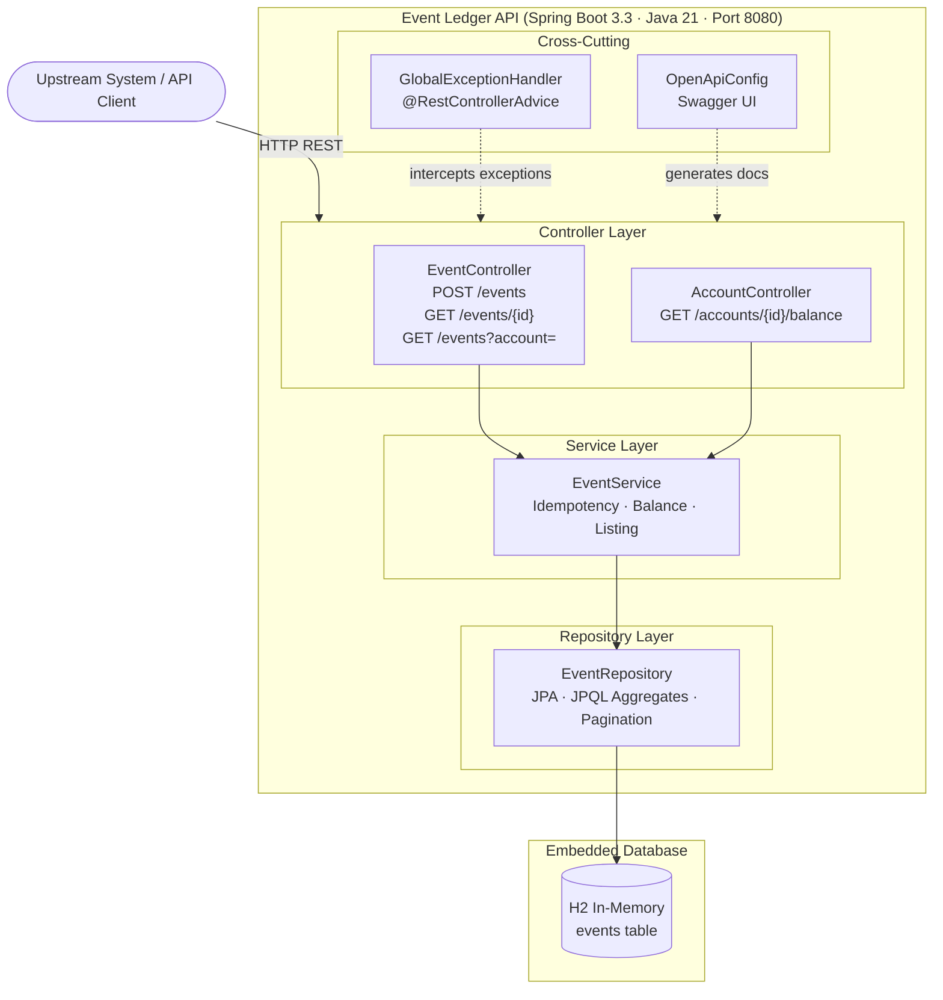
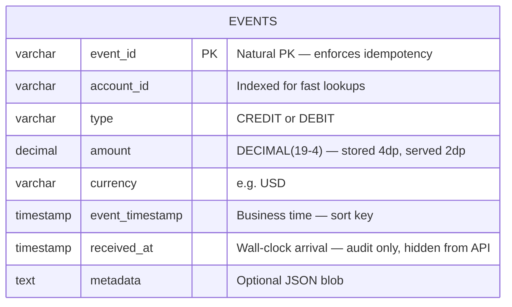
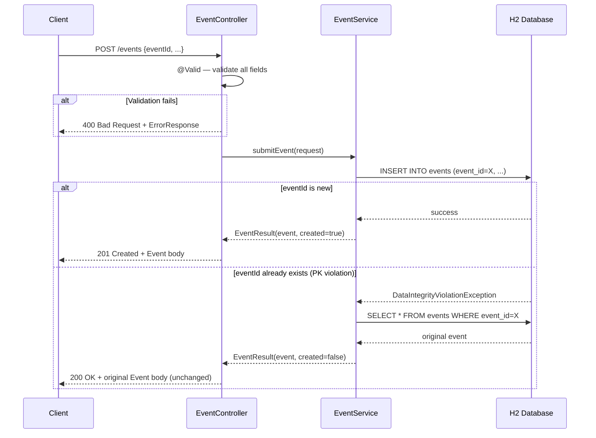
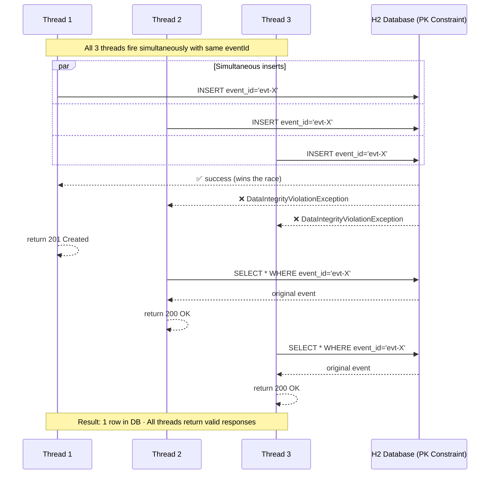
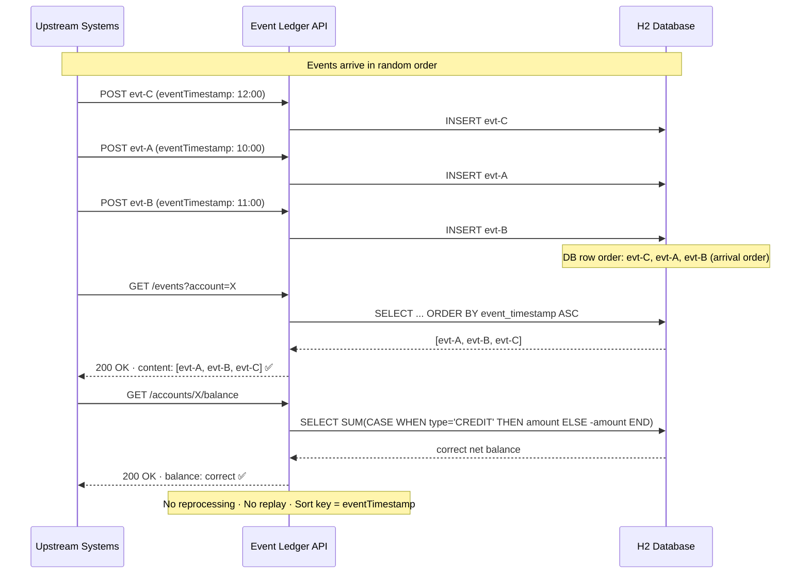
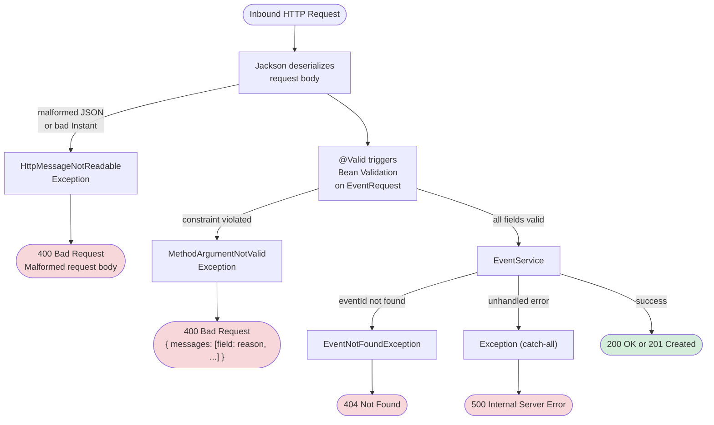
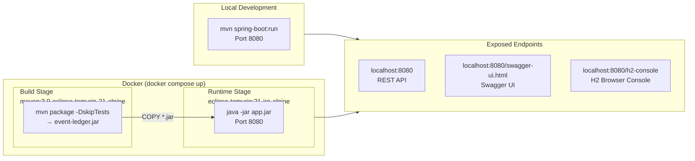

# Event Ledger — Architecture Diagrams

---

## 1. System Layers



---

## 2. Data Model (ER Diagram)



> No `ACCOUNTS` table. Balances are always derived from `EVENTS` by aggregation — there is no mutable account record.

---

## 3. POST /events — Idempotency Flow



---

## 4. Concurrent Duplicate Handling



---

## 5. GET /events — Out-of-Order Tolerance



---

## 6. Balance Computation

```mermaid
flowchart TD
    A([GET /accounts/{accountId}/balance]) --> B[AccountController]
    B --> C[EventService.getBalance]
    C --> D[(JPQL Aggregate Query)]

    D --> E{"Any events\nfor account?"}

    E -->|No| F["COALESCE returns 0\ncurrency defaults to USD"]
    E -->|Yes| G["SUM CREDIT amounts\n− SUM DEBIT amounts"]

    G --> H[Fetch earliest event's currency]
    H --> I["Build BalanceResponse\naccountId · balance · currency"]
    F --> I

    I --> J["Serialize balance\nto 2 decimal places"]
    J --> K([200 OK · BalanceResponse JSON])

    style D fill:#e8f4f8
    style K fill:#d4edda
    style F fill:#fff3cd
```

---

## 7. Validation & Error Handling



---

## 8. Deployment Architecture


