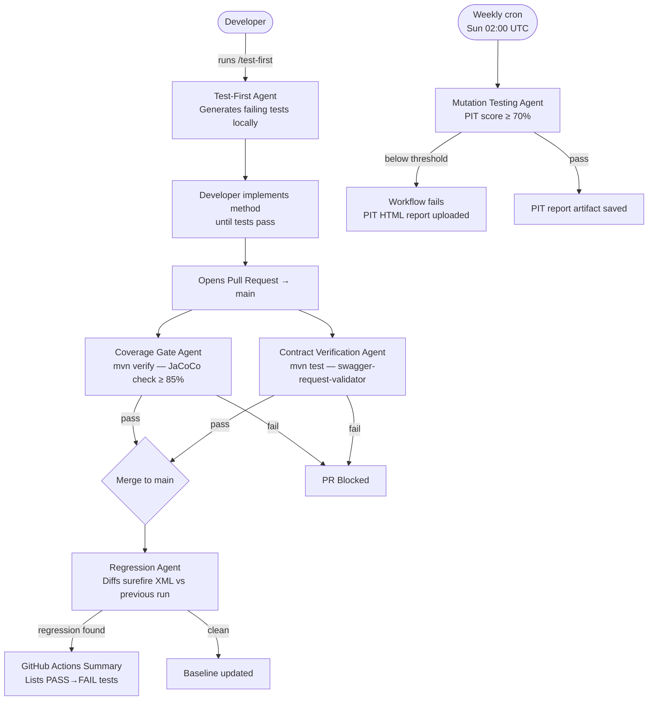

# QA Agent Pipeline — Design Document

## 1. Overview

The Event Ledger API uses a five-agent QA pipeline that replaces manual, one-shot quality checks with continuous, automated enforcement across the full development lifecycle. Before this pipeline, code coverage was measured once by hand, tests were written after implementation, and there was no guarantee that a merged PR didn't silently break the OpenAPI contract or regress a previously passing test. Each agent targets a specific quality gap: one runs locally before any code is written (Test-First), two block pull requests (Coverage Gate, Contract Verification), one monitors every merge to main (Regression), and one runs on a weekly schedule to surface weak assertions (Mutation Testing).

---

## 2. Agent Inventory

| # | Agent | Type | Trigger | Gate |
|---|-------|------|---------|------|
| 1 | Test-First Agent | Claude Code slash command | `/test-first` on developer laptop | Generative — no pass/fail |
| 2 | Coverage Gate Agent | GitHub Actions workflow | PR opened/updated → `main` | Line coverage ≥ 85% |
| 3 | Mutation Testing Agent | GitHub Actions workflow | Weekly cron (Sun 02:00 UTC) + manual | Mutation score ≥ 70% |
| 4 | Regression Agent | GitHub Actions workflow | Push merged → `main` | Zero PASS → FAIL changes |
| 5 | Contract Verification Agent | JUnit integration test + CI | Every `mvn test` run | All requests/responses match OpenAPI spec |

---

## 3. Architecture — Trigger Map



---

## 4. Agent Details

### 4.1 Test-First Agent

**Purpose**
Prevents the most common cause of weak test coverage: tests written after the fact, shaped around the implementation rather than the intended behaviour. By generating failing tests from a method signature *before* any implementation exists, the agent forces the developer to think about edge cases upfront and ensures tests make real assertions rather than just calling the method.

**Trigger**
Developer runs `/test-first` in Claude Code on their laptop, provides a class name and method description.

**Implementation**
A Claude Code custom slash command defined in `.claude/commands/test-first.md`. The command instructs Claude to:
1. Read the relevant source class and all `.claude/rules/` files
2. Generate JUnit 5 tests covering the happy path, every visible branch, and at least one edge case
3. Append tests to the correct `*Test.java` file (or create it)
4. Explicitly NOT implement the method itself
5. List which assertions will fail and why

**Output**
Failing test methods appended to the correct test class. Developer runs `mvn test` to see them fail, then implements the method until they pass.

**How to use locally**
```
/test-first EventService.submitEvent
/test-first AccountController.getBalance
```

**Threshold / failure condition**
None — this agent is generative. It cannot block a PR. Its quality gate is human: the developer must make the generated tests pass before the PR is opened.

---

### 4.2 Coverage Gate Agent

**Purpose**
Prevents coverage from silently eroding as new code is added. Without this gate, a developer can add a new method, write no test, and merge — and the only way to notice is to re-run the JaCoCo report manually. This agent makes that impossible: a PR that drops line coverage below 85% cannot be merged.

**Trigger**
GitHub Actions `pull_request` event targeting `main`. Runs on every push to the PR branch.

**Implementation**
The JaCoCo Maven plugin already exists in `pom.xml` with `prepare-agent` and `report` goals. A third `check` execution is added, bound to the `verify` phase, with a `COVEREDRATIO` minimum of `0.85`. The GitHub Actions workflow runs `mvn verify` (not `mvn test`) so the check goal executes. If coverage is below 85%, Maven exits non-zero and the workflow step fails.

```
pom.xml → jacoco-maven-plugin → <execution id="check"> → verify phase → minimum 0.85
.github/workflows/coverage-gate.yml → mvn verify → uploads target/site/jacoco/ as artifact
```

**Output**
JaCoCo HTML report uploaded as a GitHub Actions artifact on every run (pass or fail), browsable via the Actions tab.

**How to run locally**
```bash
mvn verify
# Open target/site/jacoco/index.html to see the report
```

**Threshold / failure condition**
`LINE` coverage ratio < `0.85` → `mvn verify` exits 1 → PR check fails.

---

### 4.3 Mutation Testing Agent

**Purpose**
Line coverage answers "was this line executed?" but not "would a test catch a bug here?" A test that calls `getBalance()` and only asserts `assertThat(result).isNotNull()` covers the line but lets any arithmetic error through. PIT mutation testing answers the harder question: it systematically corrupts the production code (flips conditionals, removes return values, changes operators) and checks whether at least one test fails. If no test fails, the mutation "survives" — a sign the test suite has a blind spot.

**Trigger**
GitHub Actions `schedule` (Sunday 02:00 UTC) and `workflow_dispatch` (manual trigger from the Actions tab). Not on every PR — PIT is slow (it reruns the test suite once per mutation) and is better suited to a weekly hygiene check than a PR gate.

**Implementation**
`pitest-maven` plugin added to `pom.xml`. Configured to target `com.eventledger.*` classes, exclude `EventLedgerApplication`, and fail if mutation score < 70%. Outputs both HTML and XML reports to `target/pit-reports/`.

```
pom.xml → pitest-maven 1.15.8 → mutationThreshold=70
.github/workflows/mutation-testing.yml → mvn test-compile pitest:mutationCoverage
                                       → uploads target/pit-reports/ as artifact
```

**Output**
PIT HTML report uploaded as a versioned artifact (`pitest-report-<run-number>`). Shows each mutation, which test killed it, and which survived. Browsable from the Actions tab.

**How to run locally**
```bash
mvn test-compile org.pitest:pitest-maven:mutationCoverage
# Open target/pit-reports/<timestamp>/index.html
```

**Threshold / failure condition**
Overall mutation score < 70% → Maven exits 1 → workflow fails.

---

### 4.4 Regression Agent

**Purpose**
A "all tests green" signal on a PR is necessary but not sufficient. It does not tell you whether a test that was green on the previous commit is still green — it only tells you nothing is red *right now*. If a refactor changes a method's side effects in a subtle way, a test that was previously exercising that side effect might be testing the wrong thing and still pass. The Regression Agent detects *status changes* across runs, not just the current state.

**Trigger**
GitHub Actions `push` event on `main`. Runs after every merge.

**Implementation**
The workflow runs the full integration test suite (`mvn test -Dtest="*IntegrationTest"`), then downloads the Surefire XML from the previous main run (using `dawidd6/action-download-artifact`), and runs a Python script that parses both XML sets and diffs them. The current run's XML is then uploaded as the new baseline artifact (overwriting the previous). On the first ever run, no previous artifact exists — `continue-on-error: true` handles this gracefully and the baseline is established.

```
.github/workflows/regression.yml → mvn test → download previous artifact
                                 → .github/scripts/diff-surefire.py
                                 → upload current surefire-reports/ as artifact
.github/scripts/diff-surefire.py → parses TEST-*.xml → prints PASS→FAIL list
                                 → writes to GITHUB_STEP_SUMMARY → exits 1 on regression
```

**Output**
GitHub Actions job summary showing:
- `REGRESSIONS` — tests that were PASS and are now FAIL (causes exit 1)
- `Fixed` — tests that were FAIL and are now PASS (informational)
- `New tests` — tests not present in the previous run (informational)

**How to run locally**
```bash
mvn test -Dtest="*IntegrationTest"
python3 .github/scripts/diff-surefire.py
# (requires previous-results/ directory with a prior surefire XML set)
```

**Threshold / failure condition**
Any PASS → FAIL transition → Python script exits 1 → workflow step fails.

---

### 4.5 Contract Verification Agent

**Purpose**
The OpenAPI spec (generated by springdoc from `@Operation`, `@ApiResponse`, and `@Schema` annotations) is the agreed contract with API consumers. Without automated enforcement, it is easy to break this contract silently: rename a JSON field, change a status code, expose `receivedAt` by removing `@JsonIgnore`, or return `amount` as an integer instead of a decimal. None of these would fail the existing tests, which assert on specific values but not on the overall response shape against the spec. This agent catches all of them.

**Trigger**
Runs as part of every `mvn test` execution — on PRs, on the developer's machine, and as part of any CI run. It is a JUnit `@SpringBootTest` class, so it runs automatically with no separate workflow step needed.

**Implementation**
The `swagger-request-validator-mockmvc` library (Atlassian, v2.41.0) adds a single MockMvc result matcher: `.andExpect(openApi().isValid(SPEC))`. This matcher fetches the live OpenAPI spec from springdoc's `/v3/api-docs` endpoint (running in the test Spring context), then validates the actual request and actual response against it — checking HTTP method, path, request body schema, response status code, and response body schema in one call. No committed YAML file is needed; the spec is always current because it is generated from the annotations at test startup.

A dedicated `ContractVerificationTest.java` class exercises all four endpoints with representative requests.

```
pom.xml → swagger-request-validator-mockmvc 2.41.0 (test scope)
src/test/java/com/eventledger/ContractVerificationTest.java
    → @SpringBootTest + @AutoConfigureMockMvc
    → .andExpect(openApi().isValid("http://localhost/v3/api-docs"))
    → 5 tests covering POST /events, GET /events/{id}, GET /events,
      GET /accounts/{id}/balance, 400 error shape
```

**Output**
Standard JUnit test failure with a detailed message describing which part of the contract was violated (e.g., `Response body validation error: amount: expected number with 2 decimal places`).

**How to run locally**
```bash
mvn test -Dtest="ContractVerificationTest"
```

**Threshold / failure condition**
Any request or response that violates the OpenAPI spec → assertion fails → test fails → `mvn test` exits 1 → PR check fails.

---

## 5. Technology Choices and Rationale

| Technology | Version | Reason chosen |
|-----------|---------|---------------|
| JaCoCo | 0.8.11 | Already in `pom.xml`; native Maven lifecycle; `check` goal integrates with `verify` phase without extra tooling |
| PIT (pitest-maven) | 1.15.8 | De-facto Java mutation testing standard; Maven plugin; no separate process; HTML report out of the box |
| swagger-request-validator-mockmvc | 2.41.0 | Validates both request and response in one matcher call; works against springdoc's live spec; no committed YAML contract file to maintain |
| Python (stdlib) for surefire diff | 3.x | Zero dependencies; parses standard Maven Surefire XML; portable across all GitHub-hosted runners |
| dawidd6/action-download-artifact | v3 | Community standard for downloading artifacts from previous workflow runs; handles missing artifact gracefully |

---

## 6. Coverage vs Mutation: Why Both?

Line coverage and mutation score measure fundamentally different things:

| Metric | Question answered | What it misses |
|--------|------------------|----------------|
| Line coverage (JaCoCo) | Was this line executed by a test? | Whether the test asserted anything meaningful about the result |
| Mutation score (PIT) | Would a test catch a bug introduced here? | Lines that are never executed (those are JaCoCo's job) |

**Example where they diverge:**
```java
// EventService.getBalance — this line has 100% line coverage
return new BalanceResponse(accountId, balance, currency);
```
A test that calls `getBalance("acct-1")` and asserts only `assertThat(result).isNotNull()` gives 100% line coverage but a 0% mutation score on the `currency` field assignment — PIT would flip the currency to `null`, and the test would still pass. Both agents are needed to catch the full range of quality problems.

---

## 7. Contract Drift: What Gets Caught

Examples of changes that would pass all existing tests but fail `ContractVerificationTest`:

| Change | Why existing tests miss it | What catches it |
|--------|---------------------------|-----------------|
| Remove `@JsonIgnore` from `receivedAt` | No test asserts `.doesNotExist()` on `receivedAt` in this context | `openApi().isValid()` — `receivedAt` is not declared in the spec |
| `amount` serialized as integer (remove `BigDecimalScaleSerializer`) | Tests assert `$.amount == 100.00` — integer `100` still equals `100.00` in some comparisons | `openApi().isValid()` — spec declares `amount` as a formatted decimal |
| POST `/events` returns 200 instead of 201 for new events | Tests use `status().isCreated()` but contract test also validates the status | `openApi().isValid()` — spec declares `201` as the only success response |
| New required field added to `EventRequest` without `@Schema` update | Validation tests still pass with existing payloads | `openApi().isValid()` — request body no longer matches declared schema |

---

## 8. Operational Runbook

**Raise the coverage threshold**
Edit `pom.xml` → `jacoco-maven-plugin` → `<execution id="check">` → `<minimum>0.90</minimum>`

**Raise the mutation threshold**
Edit `pom.xml` → `pitest-maven` → `<mutationThreshold>80</mutationThreshold>`

**Trigger mutation testing manually**
GitHub → Actions tab → "Mutation Testing" workflow → "Run workflow" button

**Reset the regression baseline**
GitHub → Actions tab → any "Regression Guard" run → Artifacts → delete `surefire-results`.
The next push to main will re-establish the baseline from scratch.

**Use the Test-First Agent locally**
In Claude Code terminal, type:
```
/test-first EventService.submitEvent
/test-first AccountController.listEvents
```
Claude reads the method, generates failing tests, and tells you which assertions will fail.

---

## 9. Future Extensions

| Extension | Value |
|-----------|-------|
| Parallel agent runs via GitHub Actions matrix | Run unit tests and integration tests simultaneously; cuts CI time in half |
| Slack/Teams notification on regression detection | Immediate alert to the team rather than waiting for someone to check the Actions tab |
| Scheduled contract drift report as a GitHub Issue | Weekly auto-created issue listing any drift between the spec and actual API behaviour |
| Architecture Agent (Claude API) | Given a new OpenAPI endpoint spec, generates the controller stub, service method, and failing tests automatically |
| Performance baseline agent | Records p99 latency on key endpoints after each merge; alerts on regression beyond ±10% |
